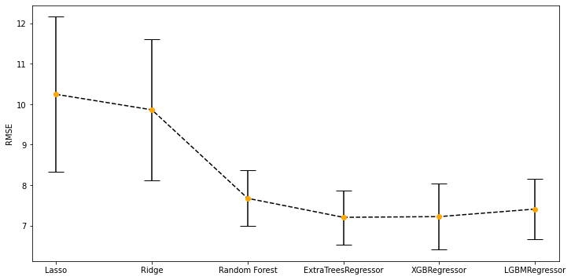
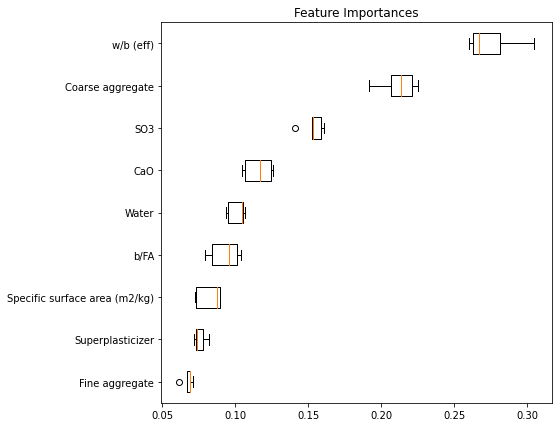

# Prediction of concrete strength by machine learning [(link)](https://concrete-strength-siwei.herokuapp.com/)
*The repository is the final project in course MSDS 699.*

#### by Siwei Ma

>Figure 1. Web app screen shot.

# Summary

Concrete is the single most widely used man-made material in the world. Construction workers reply on 
the experiments to determine the strength of concrete. The app presents an attempt to predict the strength based on the 
information of raw materials by machine learning methods. 

# Analysis Process
## Data Cleaning
The data of this project was collected from [academic research papers](https://www.journals.elsevier.com/construction-and-building-materials) and re-arranged to tidy format.

## Feature Engineering
Create features related to chemical composition and specific surface area. Impute the missing values with mean. Standardize the data for Lasso regression. 

## Modeling
The classical statistical methods like linear or non-linear regression prove to be unsuitable to cope with the complexity of modern higher performance concrete [1]. Therefore, several machine learning algorithms were used to predict the concrete strength. 

By using randomized search cross validation, extra tree regressor has the lowest RMSE score, among linear (Lasso), bagging (random forest, extra tree), boosting (xgboost, lightgbm) regressors. 

>Figure 2. Comparison between models.

We apply the model to the hold-out test data to examine the performance. The model gives reasonable prediction ranging
from 20-90 MPa. **It gives RMSE of 7.47 MPa**. 

>Figure 3. The strength prediction by extra tree regressor.

## Feature importance
Select features based on permutation importance. If two or more features are codependent, the permutation importance would give unexpected results. For example, permuting a duplicated column would still allow prediction to be half supported by the other identical column. Thus, we performed hierarchical clustering on the  Spearman rank-order correlations and only kept a single feature from each cluster to solve collinearity. The ranking of permutation importance of the selected features is shown below.

>Figure 4. Feature importance.

## Limitation
To improve the ease of use for the web app, we dramatically decreased the number of features from 153 to 9, which moderately sacrifice the accuracy of the model. The RMSE increased from 6.55 to 7.47 MPa. 

The data used in this project is from academic publications, which could be quite possible that the research work cannot represent the construction work in reality. We cannot ignore the risk of violating the fundamental assumption in standard supervised learning setting which assumes both the training data and the test data are drawn independently from identical distribution. Collecting larger data, especially the data from site construction, to mitigate this concern would be my future work.

# References
[1] Henri Van Damme, Concrete material science: Past, present, and future innovations, Cement and Concrete Research, Volume 112, 2018, Pages 5-24, ISSN 0008-8846

[2] Tianyu Xie, M.S. Mohamad Ali, Mohamed Elchalakani, Phillip Visintin, Modelling fresh and hardened properties of self-compacting concrete containing supplementary cementitious materials using reactive moduli, Construction and Building Materials, Volume 272, 2021, 121954, ISSN 0950-0618
